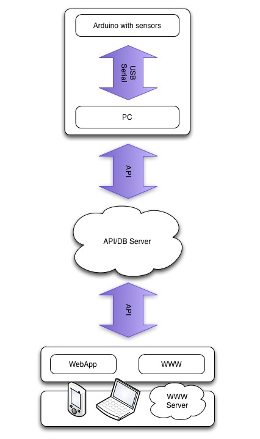

.. _architecture:

Architecture
============

**Arduino(s)** and **PC** are forming an **"Aquino device"**

Arduino is providing measurements over the serial interface in JSON
format. It is also using the same way of communication to receive orders
to control aquarium system.

.. note::

   There is an idea to allow for more than one Arduino connected to
   the PC. Each Arduino (with the set of sensors) is used to measure
   and control a different tank. This would lower the cost of potential
   multitank installation

PC is a Linux box. It is temporarily collecting the
data in database (redis) and storing them on the server when web is available.
PC might be configured using web interface. Configuration is stored in
database.

.. note::

   Typical Aquino device will use Raspberry Pi

There is also an **LCD display** to show measurements next to the tank.

**REST API server** will work as an invisible layer between
client applications and the device. It is providing the way to save
measurements, serving data to the clients, passing orders from client to
device.

Everything which is displaying collected data is considered a Client. Be it
mobile app (Mozilla WebApp will be written as a part of ths project) website
or desktop app.

**WebApp**. Part of the Aquino is an `Open WebApp
<https://developer.mozilla.org/en-US/docs/Apps>`_ to receive notifications
and control the devices and notifications on all possible clients
(mobile/tablet/desktop)

.. note::

   **Why mozilla webApp?** As it will work on any device

   **By any, do you imply any device that could run mozilla browser? i.e.
   not iphone?** Almost every smartphone is (or will be at the time this
   project will see daylight) able to run this type of webapps. It's
   already possible on iOS, Android. Also, there will be an open REST API
   which will allow to write apps for any system.

.. raw:: html

    
